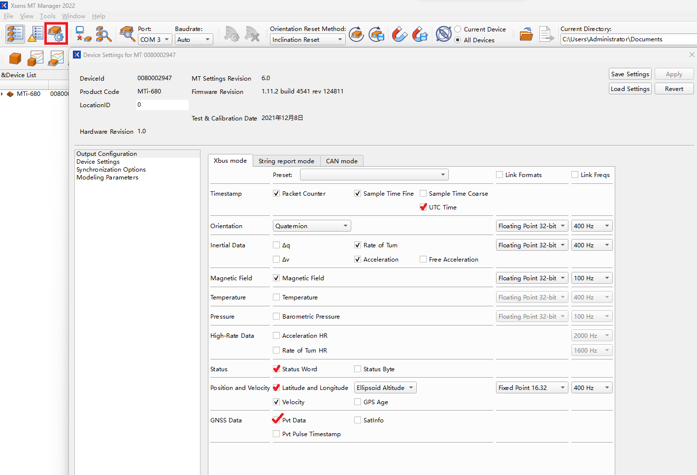
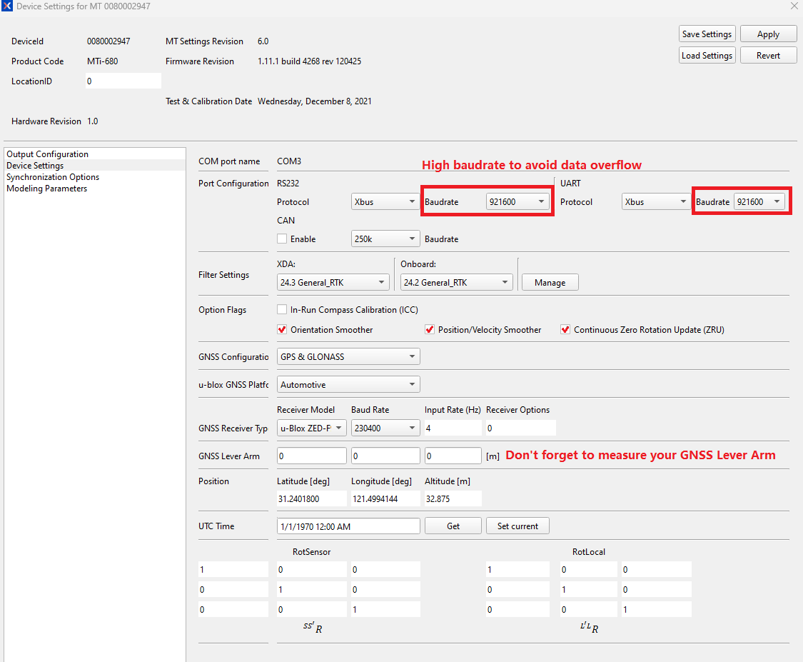

# Xsens MTi ROS2 驱动和 Ntrip 客户端

[English Version (英文版)](README.md)


此代码基于官方Xsens 2025.0 [开源Xsens设备API](https://base.movella.com/s/article/Introduction-to-the-MT-SDK-programming-examples-for-MTi-devices)，在Ubuntu 22.04.3 LTS的ROS2 Humble环境下测试过MTi-680G,MTi-8,MTi-630,MTi-300。

## ROS与ROS2版本

请注意，此分支包含与`Foxy`, `Humble`和`Jazzy`兼容的`ROS2`实现。

如果您正在寻找`ROS1`版本，请访问[`main`](https://github.com/xsenssupport/Xsens_MTi_ROS_Driver_and_Ntrip_Client/tree/main)分支。


## 如何克隆此ROS2分支

```
git clone --branch ros2 https://github.com/xsenssupport/Xsens_MTi_ROS_Driver_and_Ntrip_Client.git
```

## 设备设置 - 输出配置
- 对于 MTi-680(G)或者MTi-8，需要启用 UTC 时间和 PvtData，以便从 ``/nmea`` 话题获取 GPGGA 数据，该数据将用于 Ntrip 客户端：
    - 在 MT Manager 的设备设置中，配置输出，选择 “UTC Time, Sample TimeFine, Status Word, Latitude and Longitude” 以及其他必要数据，并点击 “Apply”；
    - 或者将 [xsens_mti_node.yaml](./src/xsens_mti_ros2_driver/param/xsens_mti_node.yaml) 中的 ``enable_deviceConfig`` 设置为 `true`，并将 ``pub_utctime`` 和 ``pub_gnss`` 设置为 `true`，然后根据需要调整其他输出参数，以完成传感器配置。

以下是推荐的输出配置和设备设置：





## 对MTi ROS驱动的修改：

- 修复了 ``/nmea`` GPGGA 话题的 fix_type 以符合 NMEA 标准。
- 添加了以下功能：
    - 传感器输出配置；
    - 传感器滤波设置；
    - 设置波特率；
    - 设置 MTi-8/MTi-680(G) 的 GNSS 杆臂；
    - 设置 u-Blox GNSS 平台；
    - 配置选项（如 AHS、In-Run Compass、北斗、OrientationSmoother、PositionVelocitySmoother、ContinuousZRU）；
    - 周期性地估计陀螺仪偏差(Manual Gyro Bias Estimation)；
    - 添加 ``filter/euler`` 和HR高速率话题，如 ``imu/acceleration_hr``、``imu/angular_velocity_hr``；
    - 添加报错信息。
    - 支持生命周期节点（configure/activate/deactivate/cleanup），并提供 ``autostart`` 参数；
    - 在 ``/diagnostics`` 话题上发布诊断信息。

- 修改了以下代码：
    - ``lib/xspublic/xscontroller/iointerface.h``，第 138 行，将 `PO_XsensDefaults` 改为 ``PO_OneStopBit``；
    - ``lib/xspublic/xscommon/threading.cpp``，更新以兼容 glibc 2.35。

## Ntrip客户端
Ntrip客户端订阅来自``xsens_mti_ros2_driver``的``/nmea`` 话题，并等待获取 GPGGA 数据（最长 300 秒）。随后，每 1 秒（由 [ntrip.launch](./src/ntrip/launch/ntrip.launch) 定义）向 Ntrip Caster (服务器) 发送 GPGGA 数据。

用户需要更改``ntrip_launch.py``以适应自己的凭证/服务器/挂载点。

## 安装方法
安装依赖项：
```
sudo apt install ros-$ROS_DISTRO-nmea-msgs
sudo apt install ros-$ROS_DISTRO-mavros-msgs
```
例如对于ROS2 Humble：
```
sudo apt install ros-humble-nmea-msgs
sudo apt install ros-humble-mavros-msgs
```

在``src/ntrip/launch/ntrip_launch.py``中更改NTRIP凭证/服务器/挂载点为您自己的。

运行以下代码：
```
mv Xsens_MTi_ROS_Driver_and_Ntrip_Client ros2_ws
cd ~/ros2_ws
colcon build
```

在您的ROS2工作区内，source ``install/setup.bash``文件
```
source install/setup.bash
```
或者

将其加入到规则中：
```
sudo nano ~/.bashrc
```
在文件末尾添加以下行：
```
source /home/[USER_NAME]/ros2_ws/install/setup.bash
```
保存文件，退出。

注意：如果您不在`~/.bashrc`中添加此源行，那么每次打开新终端时，您都必须首先执行`source install/setup.bash`，否则您无法读取`/status`主题数据。

## 如何使用：
打开第一个终端：
```
ros2 launch xsens_mti_ros2_driver xsens_mti_node.launch.py
```
或者使用3D显示器rviz：
```
ros2 launch xsens_mti_ros2_driver display.launch.py
```
然后打开另一个终端
```
ros2 launch ntrip ntrip_launch.py
```

## 生命周期与诊断信息

### 生命周期（Lifecycle）

本驱动是一个受管理的生命周期节点（managed/lifecycle node），因此可以按需启动、暂停和释放
MTi 设备，而不再只能在进程启动和退出时进行。

默认行为与以往完全一致：参数 `autostart` 默认为 `true`，节点在启动时会自动完成配置并激活，
像以前一样直接输出数据。

若要自行控制状态切换，请将 `autostart` 设为 `false`：

```
ros2 run xsens_mti_ros2_driver xsens_mti_node --ros-args -p autostart:=false

ros2 lifecycle get /xsens_driver             # unconfigured [1]
ros2 lifecycle set /xsens_driver configure   # -> inactive [2]
ros2 lifecycle set /xsens_driver activate    # -> active [3]
```

请注意：使用 `ros2 run` 启动时节点名为 `xsens_driver`，而通过
`xsens_mti_node.launch.py` 启动时节点名为 `xsens_mti_node`。

| 状态切换 | 对设备的操作 |
| -------- | ------------ |
| configure | 打开串口，读取设备信息，创建各个话题发布者，并写入设备配置 |
| activate | 让设备进入测量模式（measurement mode），按需启动录制与周期性陀螺仪零偏估计（MGBE），并开始发布数据 |
| deactivate | 停止录制并让设备回到配置模式（config mode），停止发布数据 |
| cleanup | 关闭串口并销毁发布者，串口随之释放给其他程序使用 |
| shutdown | 退出测量模式并释放全部资源 |

所有消息发布者都是生命周期发布者（lifecycle publisher），因此在节点未激活时不会有任何消息
发送到网络上。同时设备也会退出测量模式，所以 `deactivate` 可以干净地暂停传感器，`cleanup`
可以释放串口，两者都无需重启进程。再次执行 `configure` 会重新打开串口并从头开始。

### 诊断信息（Diagnostics）

节点处于激活状态时，会在 `/diagnostics` 话题上发布 `diagnostic_msgs/DiagnosticArray`，这是
`rqt_robot_monitor` 和 `diagnostic_aggregator` 所读取的标准话题：

```
ros2 topic echo /diagnostics
```

共发布三条状态信息：

| 状态 | 内容 | 报警级别 |
| ---- | ---- | -------- |
| Device | 产品型号、设备 ID、固件版本、串口、波特率，以及设备报告的错误次数 | 未连接设备时为 ERROR；自上次发布以来设备报告过错误时为 WARN |
| Data stream | 已接收的数据包数量、实测频率（Hz）以及距离上一个数据包的时间 | 处于测量模式却收不到数据时为 ERROR；超过 `diagnostics_stale_timeout` 秒没有数据时为 STALE；频率低于 `diagnostics_min_rate` 时为 WARN |
| Filter status | 将 MTi 状态字（status word）解析为姿态是否有效、GNSS 定位、RTK 状态、削波（clipping）标志、无旋转更新状态、滤波模式和时钟同步等 | 姿态无效或传感器数据出现削波时为 WARN |

其中 Data stream 是确认 MTi 是否仍按设定频率输出数据最快捷的方式。例如 MTi-680G 以 400 Hz
运行时：

```
  name: 'xsens_driver: Data stream'
  message: Streaming at 401.8 Hz
  values:
  - key: Packets received
    value: '19394'
  - key: Rate (Hz)
    value: '401.8'
```

诊断相关参数在 `param/xsens_mti_node.yaml` 中配置：

| 参数 | 默认值 | 含义 |
| ---- | ------ | ---- |
| `diagnostics_enabled` | `true` | 是否发布诊断信息 |
| `diagnostics_period` | `1.0` | 发布周期，单位为秒 |
| `diagnostics_min_rate` | `0.0` | 实测数据包频率低于该值（Hz）时报 WARN，设为 `0.0` 则不检查。建议取略低于 `output_data_rate` 的值 |
| `diagnostics_stale_timeout` | `1.0` | 超过该秒数没有收到数据包时，将数据流标记为 STALE |

## 如何确认您的RTK状态

您可以检查``ros2 topic echo /rtcm``，应该有HEX RTCM数据出现，

或者通过``ros2 topic echo /status``检查RTK Fix类型，应该为1(RTK Floating)或2(RTK Fix)。


## ROS 话题

| 话题                      | 消息类型                        | 消息内容                                                                                                                                      | 数据输出频率<br>（取决于 MT Manager 中的模型和输出配置）                         |
| ------------------------ | ------------------------------- | --------------------------------------------------------------------------------------------------------------------------------------------- | ------------------------------------------------------------------------------- |
| filter/free_acceleration | geometry_msgs/Vector3Stamped    | free acceleration from filter, which is the acceleration in the local earth coordinate system (L) from which<br>the local gravity is deducted | 1-400Hz(MTi-600 and MTi-100 series), 1-100Hz(MTi-1 series)                      |
| filter/positionlla       | geometry_msgs/Vector3Stamped    | filtered position output in latitude (x), longitude (y) and altitude (z) as Vector3, in WGS84 datum                                           | 1-400Hz(MTi-600 and MTi-100 series), 1-100Hz(MTi-1 series)                      |
| filter/quaternion        | geometry_msgs/QuaternionStamped | quaternion from filter                                                                                                                        | 1-400Hz(MTi-600 and MTi-100 series), 1-100Hz(MTi-1 series)                      |
| filter/euler        | geometry_msgs/Vector3Stamped | euler(roll,pitch,yaw) from filter                                                                                                                        | 1-400Hz(MTi-600 and MTi-100 series), 1-100Hz(MTi-1 series)                      |
| filter/twist             | geometry_msgs/TwistStamped      | filtered velocity and calibrated angular velocity                                                                                                                 | 1-400Hz(MTi-600 and MTi-100 series), 1-100Hz(MTi-1 series)                      |
| filter/velocity          | geometry_msgs/Vector3Stamped    | filtered velocity output as Vector3                                                                                                           | 1-400Hz(MTi-600 and MTi-100 series), 1-100Hz(MTi-1 series)                      |
| gnss                     | sensor_msgs/NavSatFix           | raw 4 Hz latitude, longitude, altitude and status data from GNSS receiver                                                                     | 4Hz                                                                             |
| gnss_pose                | geometry_msgs/PoseStamped       | filtered position output in latitude (x), longitude (y) and altitude (z) as Vector3 in WGS84 datum, and quaternion from filter                | 1-400Hz(MTi-600 and MTi-100 series), 1-100Hz(MTi-1 series)                      |
| imu/acceleration         | geometry_msgs/Vector3Stamped    | calibrated acceleration                                                                                                                       | 1-400Hz(MTi-600 and MTi-100 series), 1-100Hz(MTi-1 series)                      |
| imu/angular_velocity     | geometry_msgs/Vector3Stamped    | calibrated angular velocity                                                                                                                   | 1-400Hz(MTi-600 and MTi-100 series), 1-100Hz(MTi-1 series)                      |
| imu/data                 | sensor_msgs/Imu                 | quaternion, calibrated angular velocity and acceleration                                                                                      | 1-400Hz(MTi-600 and MTi-100 series), 1-100Hz(MTi-1 series)                      |
| imu/dq                   | geometry_msgs/QuaternionStamped | integrated angular velocity from sensor (in quaternion representation)                                                                        | 1-400Hz(MTi-600 and MTi-100 series), 1-100Hz(MTi-1 series)                      |
| imu/dv                   | geometry_msgs/Vector3Stamped    | integrated acceleration from sensor                                                                                                           | 1-400Hz(MTi-600 and MTi-100 series), 1-100Hz(MTi-1 series)                      |
| imu/mag                  | sensor_msgs/MagneticField    | calibrated magnetic field                                                                                                                     | 1-100Hz                                                                         |
| imu/time_ref             | sensor_msgs/TimeReference       | SampleTimeFine timestamp from device                                                                                                          | depending on packet                                                             |
| imu/utctime              | sensor_msgs/TimeReference       | UTC Time from the device                                                                                                                      | depending on packet                                                             |
| nmea                     | nmea_msgs/Sentence              | 4Hz GPGGA data from GNSS receiver PVTData(if available) and StatusWord                             | 4Hz                                                                             |
| pressure                 | sensor_msgs/FluidPressure       | barometric pressure from device                                                                                                               | 1-100Hz                                                                         |
| status                   | xsens_mti_driver/XsStatusWord | statusWord, 32bit                                                                                                                             | depending on packet                                                             |
| temperature              | sensor_msgs/Temperature         | temperature from device                                                                                                                       | 1-400Hz(MTi-600 and MTi-100 series), 1-100Hz(MTi-1 series)                      |
| tf                       | geometry_msgs/TransformStamped  | transformed orientation                                                                                                                       | 1-400Hz(MTi-600 and MTi-100 series), 1-100Hz(MTi-1 series)                      |
| diagnostics              | diagnostic_msgs/DiagnosticArray | 设备连接状态、数据流健康状况与解析后的状态字                                                                                 | diagnostics_period（默认 1Hz）                                                |
| imu/acceleration_hr         | geometry_msgs/Vector3Stamped    | high rate acceleration                                                                                                                       | see xsens_mti_node.yaml                      |
| imu/angular_velocity_hr     | geometry_msgs/Vector3Stamped    | high rate angular velocity                                                                                                                   | see xsens_mti_node.yaml                      |


请参考 [MTi 系列参考手册](https://mtidocs.movella.com/mti-system-overview) 获取详细数据定义。

## 故障排查

- 设备连不上问题， 请参考 [README.txt](./src/xsens_mti_ros2_driver/README.txt)。
- 如果使用英伟达Jetson设备，请参考 [与 NVIDIA Jetson 的接口](https://base.movella.com/s/article/article/Interfacing-MTi-devices-with-the-NVIDIA-Jetson-1605870420176)。
- 文档与代码链接：[所有 MTi 相关文档链接](https://base.movella.com/s/article/All-MTi-Related-Documentation-Links)。
- 如果问题与代码无关，请发送技术支持请求至[support@movella.com](mailto:support@movella.com)。

如果程序显示消息 `No MTi device found`：

- 对于使用了 FTDI 芯片的 MTi-1/600/Sirius 产品系列，请尝试以下步骤：
  ```bash
  sudo /sbin/modprobe ftdi_sio
  echo 2639 0300 | sudo tee /sys/bus/usb-serial/drivers/ftdi_sio/new_id
  ```
  然后，确保您属于 `dialout` 组：
  ```bash
  ls -l /dev/ttyUSB0
  groups
  ```
  如果不属于，请将自己添加到 `dialout` 组：
  ```bash
  sudo usermod -G dialout -a $USER
  ```
  最后，重启计算机：
  ```bash
  sudo reboot
  ```

- 对于 MTi-100/300/G-710 设备：
  ```bash
  git clone https://github.com/xsens/xsens_mt.git
  cd xsens_mt
  sudo make HAVE_LIBUSB=1
  sudo modprobe usbserial
  sudo insmod ./xsens_mt.ko
  ```

- 您可以在 [`xsens_mti_node.yaml`](./src/xsens_mti_ros2_driver/param/xsens_mti_node.yaml) 文件中指定自己的端口和波特率：
  ```cpp
  // 将 scan_for_devices 设置为 `false`，并取消注释/更改端口名称和波特率为您的自定义值（默认值为 115200，除非您使用 MT Manager 更改过该值）。
  scan_for_devices: false
  port: '/dev/ttyUSB0'
  baudrate: 115200
  ```

- 如果上述方法都无效，请尝试使用 `cutecom` 查看是否可以接收到 `FA FF 36` 的十六进制消息。如果没有，则可以联系 [support@movella.com](mailto:support@movella.com)：
  ```bash
  sudo apt install cutecom
  cutecom
  ```
