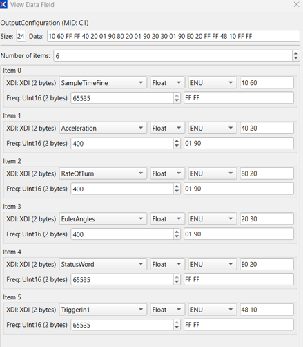
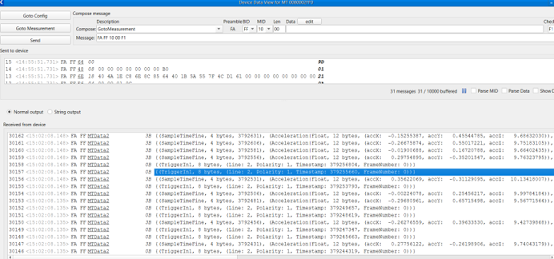
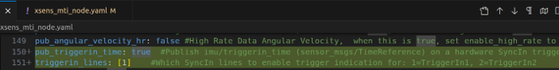
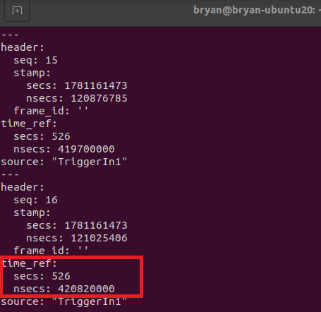
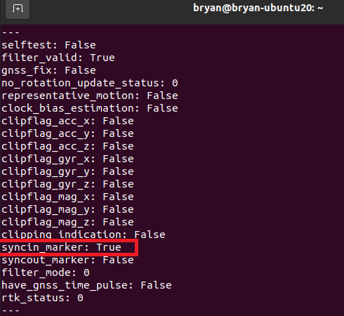

# TriggerIndication User Guide

> Last updated: 2026-06-11

> **Note**
>
> This guide explains how to configure and use TriggerIndication to obtain high-precision timestamps of trigger events.
>
> Reference article: <https://base.xsens.com/s/article/article/Synchronization-with-the-MTi>
>
> TriggerIndication is supported on the Xsens Sirius/Avior/MTi-600 series.

This guide describes how to configure an Xsens MTi sensor to output TriggerIndication (hardware SyncIn trigger indication) via MT Manager, and how to publish and view the trigger timestamp in ROS1 through `xsens_ros_mti_driver`.

---

## 1. Configure the Sensor with MT Manager

### 1.1 Enter configuration mode

```text
TX: GotoConfig
FA FF 30 00 D1

RX: GotoConfigAck
FA FF 31 00 D0
```

### 1.2 Set the sensor baudrate to 921600

```text
TX: SetPortConfig - append 4 bytes per protocol
FA FF 8C 0C 00 01 00 80 00 01 00 80 00 00 00 00 67

RX: SetPortConfigAck
FA FF 8D 00 74
```

### 1.3 Configure the output (including TriggerIndication 1)

```text
TX: SetOutputConfiguration
FA FF C0 18 10 60 01 90 40 20 01 90 80 20 01 90 20 30 01 90 E0 20 01 90 48 10 FF FF 3E

RX: SetOutputConfigurationAck
FA FF C1 18 10 60 FF FF 40 20 01 90 80 20 01 90 20 30 01 90 E0 20 FF FF 48 10 FF FF 63
```



*Figure: Device Data View output configuration.*

### 1.4 Enter measurement mode

```text
TX: GotoMeasurement
FA FF 10 00 F1

RX: GotoMeasurementAck
FA FF 11 00 F0
```

---

## 2. Trigger Test

After applying a hardware trigger on the SyncIn line, the corresponding TriggerIndication packets appear in MT Manager.



*Figure: MT Manager shows that packets 30158, 30157, etc. each emitted a TriggerIndication packet.*

---

## 3. Using It in ROS1 (Ubuntu 20.04)

### 3.1 Configure the yaml file

Edit `src/xsens_ros_mti_driver/param/xsens_mti_node.yaml`:

```yaml
pub_triggerin_time: true  # Publish imu/triggerin_time (sensor_msgs/TimeReference) on a hardware SyncIn trigger. Requires SyncIn configured on the device.
triggerin_lines: [1]      # Which SyncIn lines to enable trigger indication for: 1=TriggerIn1, 2=TriggerIn2
```



*Figure: TriggerIndication configuration in `xsens_mti_node.yaml`.*

### 3.2 View the trigger time topic

```bash
rostopic echo /imu/triggerin_time
```



*Figure: `/imu/triggerin_time` topic output on trigger.*

### 3.3 View the SyncIn flag in status

```bash
rostopic echo --filter "m.syncin_marker" /status
```



*Figure: the `syncin_marker` flag in `/status` on trigger.*

---

# Xsens MTi-630 TriggerIndication and Time Synchronization

## 1. MTData2 Packet Overview

The Xsens MTi-630 sends data through **MTData2** packets, whose contents include:

- Acceleration
- Angular Velocity (RateOfTurn)
- Orientation (as Euler angles or quaternion)
- StatusWord, etc.

If **TriggerIndication** output is additionally configured, the device emits a separate class of trigger packet.

## 2. The TriggerIndication Packet

TriggerIndication means: when a hardware trigger signal appears on **SyncIn Line1** or **SyncIn Line2**, the device emits a corresponding packet. Example data:

```text
TriggerIn2
Line:        9
Polarity:    1
Timestamp:   290637743
FrameNumber: 0
```

## 3. Data Stream Example

| # | Time | Message | Payload |
|------|--------------|--------------------|---------|
| 4122 | 10:02:21.017 | FA FF MTData2 `A1` | {(PacketCounter, 2 bytes, 44417), (SampleTimeFine, 4 bytes, 2906373), (UtcTime, 12 bytes, (ns: 999292120, Year: 2022, Month: 2, Day: 11, Hour: … |
| 4121 | 10:02:21.017 | FA FF MTData2 `0B` | {(**TriggerIn2**, 8 bytes, (Line: 9, Polarity: 1, Timestamp: 290637743, FrameNumber: 0)} |
| 4120 | 10:02:21.017 | FA FF MTData2 `A1` | {(PacketCounter, 2 bytes, 44416), (SampleTimeFine, 4 bytes, 2906348), (UtcTime, 12 bytes, (ns: 996792120, Year: 2022, Month: 2, Day: 11, Hour: … |
| 4119 | 10:02:21.017 | FA FF MTData2 `A1` | {(PacketCounter, 2 bytes, 44415), (SampleTimeFine, 4 bytes, 2906323), (UtcTime, 12 bytes, (ns: 994292120, Year: 2022, Month: 2, Day: 11, Hour: … |

From the table above:

- **Packets 4119, 4120, and 4122** are regular sensor MTData2 packets;
- **Packet 4121** is a dedicated TriggerIndication packet, indicating that a trigger signal was received at the timestamp **290637743**.

## 4. Timestamp Interpretation

### 4.1 SampleTimeFine

Regular MTData2 packets contain a **SampleTimeFine** field, for example the two packets below:

- Packet 1: SampleTimeFine = 2906348, i.e. 290634.8 ms = 290.6348 s
- Packet 2: SampleTimeFine = 2906373, i.e. 290637.3 ms = 290.6373 s

The difference of 25 corresponds to 0.0025 s (2.5 ms), which matches the 400 Hz data output rate.

### 4.2 The Trigger Timestamp

The trigger timestamp **290637743** is in microseconds (µs), i.e.:

> 290637743 µs = 290637.743 ms = 290.637743 s

## 5. Use Case: Time Synchronization Between Jetson Orin and MTi-630

Assume the following system configuration:

- An **NVIDIA Jetson Orin** connected to the Xsens MTi-630 over a **UART serial port**;
- A **GPIO pin** of the Jetson connected to the **SyncIn2** pin of the MTi-630.

The synchronization flow consists of three steps:

### Step 1: Generate the Trigger Signal

The Jetson generates a trigger signal via GPIO and precisely records the UTC time of that trigger (denoted `UtcTime_Trigger`):

```text
UtcTime_Trigger = 1781158574.123456    (in seconds, with the fractional part accurate to microseconds, i.e. 6 decimal places)
```

### Step 2: Receive the Trigger Indication

The Jetson running the ROS driver receives the TriggerIndication packet, which provides the trigger timestamp: **290637743 µs**.

### Step 3: Compute the Packet's UTC Time

From this, the UTC time of packet 4122 can be computed:

```text
UtcTime_packet_4122 = UtcTime_Trigger + (2906373 / 10000 − 290637743 / 1000000)
```

## 6. Notes

**Counter Rollover:**

- The 4-byte trigger timestamp rolls over (overflows to zero) every 2³² µs (about 4295 s);
- SampleTimeFine is likewise a 4-byte counter and also rolls over at 2³².

When computing time differences across a rollover boundary, the rollover must be handled, otherwise the time conversion will be incorrect.
